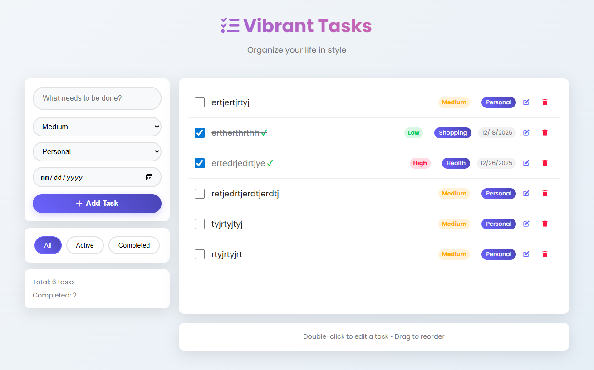

# Vibrant Todo App

A modern, visually appealing todo application with advanced features and browser storage.

## Features

- **Core Functionality**:

  - Add, edit, complete, and delete tasks
  - Filter tasks (All, Active, Completed)
  - Task statistics display

- **Advanced Features**:

  - Due dates with visual indicators
  - Task priorities (High, Medium, Low) with color coding
  - Categorization (Work, Personal, Shopping, Health)
  - Drag and drop reordering
  - Double-click to edit tasks

- **Technical Features**:
  - Responsive design for all devices
  - LocalStorage for persistent data storage
  - Modern CSS with animations and gradients
  - No external dependencies (Vanilla JavaScript)

## Usage

1. **Adding Tasks**:

   - Type your task in the input field at the top
   - Click "Add Task" or press Enter
   - Tasks are automatically added to the list

2. **Managing Tasks**:

   - **Complete a task**: Click the checkbox next to the task
   - **Edit a task**: Click the edit icon (pencil) or double-click the task text
   - **Delete a task**: Click the trash icon
   - **Reorder tasks**: Drag and drop tasks to rearrange them

3. **Filtering Tasks**:

   - Use the filter buttons to show All, Active, or Completed tasks

4. **Advanced Features**:
   - **Set Priority**: Each task shows its priority level (High, Medium, Low)
   - **Set Category**: Tasks can be categorized for better organization
   - **Set Due Date**: Add due dates to tasks for better time management

## Technical Details

- **Frontend**: HTML5, CSS3, JavaScript (Vanilla)
- **Storage**: Browser's localStorage API
- **Responsive**: Mobile-first design that works on all devices
- **No External Dependencies**: Pure client-side implementation

## Files

- `index.html` - Main application structure
- `styles.css` - Complete styling with vibrant colors and modern design
- `script.js` - JavaScript functionality with all features

## Browser Support

This application works in all modern browsers including:

- Chrome 60+
- Firefox 55+
- Safari 10+
- Edge 16+

## Local Development

To run the application locally:

1. Download or clone the repository
2. Open `index.html` in your web browser
3. Start using your todo app!

All data is stored in your browser's localStorage and will persist between sessions.

## Customization

You can easily customize the app by modifying:

- Colors in `styles.css` (variables section)
- Font family in `styles.css` (font import)
- Default categories and priorities in `script.js`

## License.

This project is open source and available under the MIT License.
